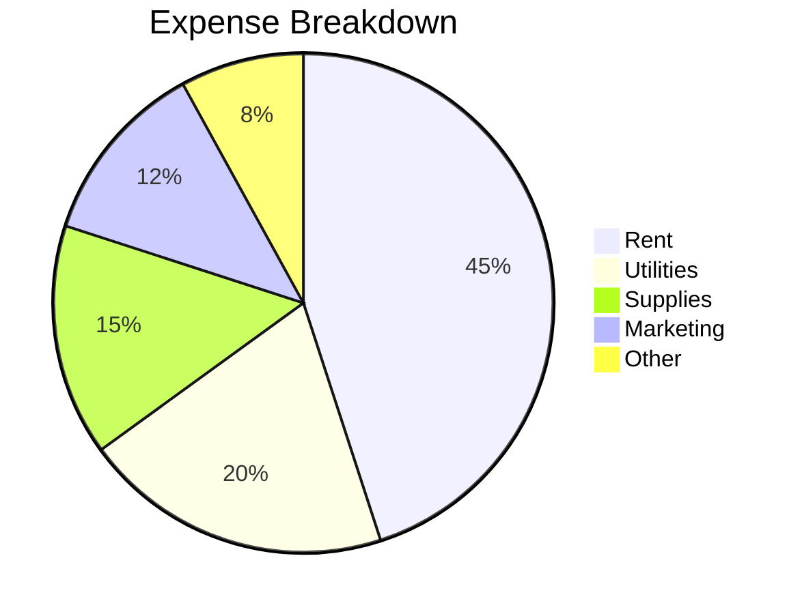

---
{"dg-publish":true,"dg-path":"Index-x/Untitled 3.md","permalink":"/index-x/untitled-3/","noteIcon":""}
---

this is pretty blank. how about a table then?

# Test Data

## Sample Table

|Month|Revenue|Expenses|Net|
|---|---|---|---|
|Jan|$4,200|$2,800|$1,400|
|Feb|$5,100|$3,200|$1,900|
|Mar|$3,800|$2,600|$1,200|
|Apr|$6,300|$3,900|$2,400|

## Sample Chart (Mermaid)

```mermaid
%%{init: {'theme':'base'}}%%
xychart-beta
    title "Monthly Revenue vs Expenses"
    x-axis [Jan, Feb, Mar, Apr]
    y-axis "Amount ($)" 0 --> 7000
    bar [4200, 5100, 3800, 6300]
    bar [2800, 3200, 2600, 3900]
```

---

**Alternative - Pie Chart:**

